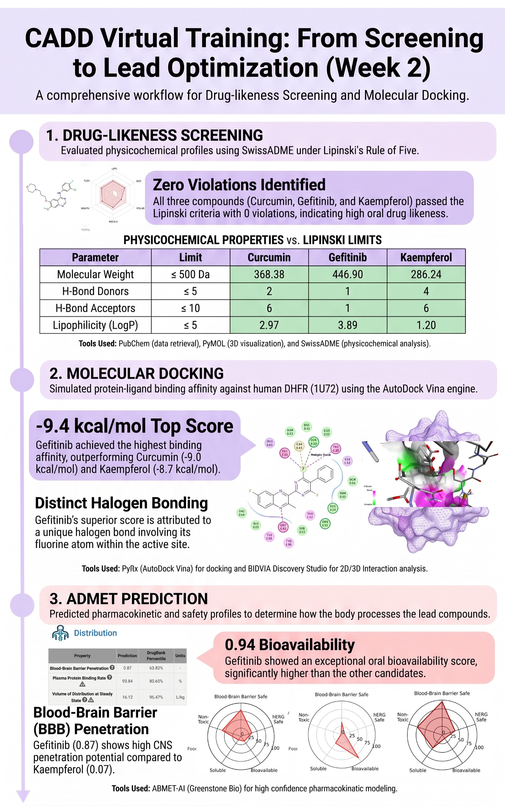
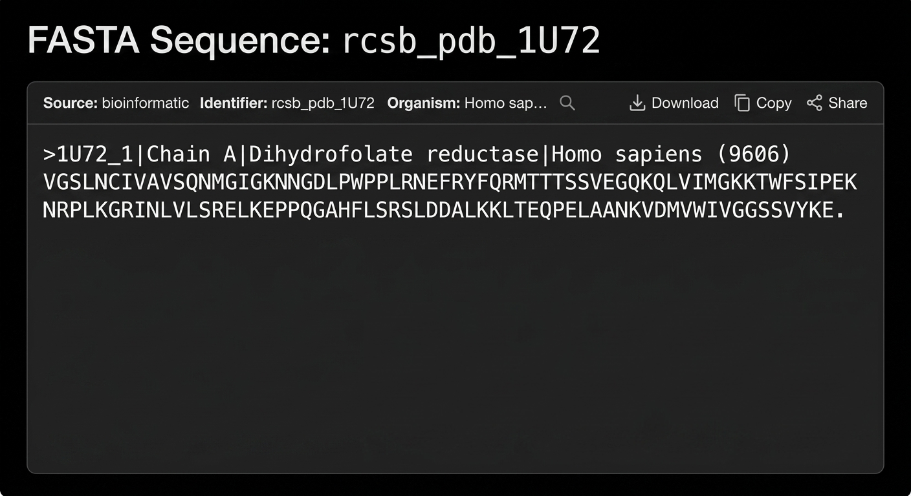
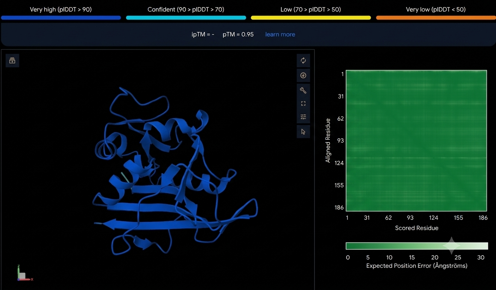
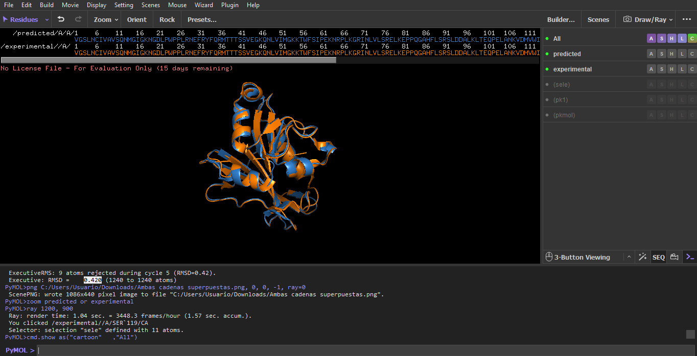

# Insilico Lab - CADD Training (Cohort 5)
<p align="center">
  
  
  
  
</p>
<p align="center">
  <em>The Insilico Lab · 3-Week Virtual Training in Computer-Aided Drug Design (CADD)</em><br>
  <strong>Caren Moreno</strong> · Bioinformatics · 2026
</p>


Repository documenting my work in The Insilico Lab's 3-Week Virtual Training in Computer-Aided Drug Design (CADD), Cohort 5 (July 2026). Covers protein/ligand preparation, molecular docking, ADMET screening, and AI-based structure prediction, using PyMOL, UCSF Chimera, RCSB PDB, and proteins.plus.

## 📅 Training Overview
- **Program:** The Insilico Lab, 3-Week Virtual Training in CADD
- **Cohort:** 5
- **Dates:** July 3 – July 19, 2026
- **Tools used:** PyMOL, UCSF Chimera, RCSB PDB, proteins.plus (DoGSiteScorer), AlphaFold3

## 📂 Repository Structure
```
Insilico-Lab-CADD-Training/
|
├── Week1_Protein_Target_Selection/
│   ├── Task1_Structure_Selection/
│   ├── Task2_Binding_Site_Analysis/
│   ├── Task3_Protein_Preparation/
│   └── screenshots/
├── Week2_Drug_Likeness_Docking_ADMET/
│   ├── Task1_SwissADME/
│   ├── Task2_PyRx_Docking/
│   ├── Task3_ADMET/
│   └── screenshots/
├── Week3_.../
└── README.md


Insilico-Lab-CADD-Training/
|
├── Week1_Protein_Target_Selection/
│   ├── Task1_Structure_Selection/
│   ├── Task2_Binding_Site_Analysis/
│   ├── Task3_Protein_Preparation/
│   └── screenshots/
├── Week2_Drug_Likeness_Docking_ADMET/
│   ├── Task1_SwissADME/
│   ├── Task2_PyRx_Docking/
│   ├── Task3_ADMET/
│   └── screenshots/
├── Week3_AlphaFold3_Structure_Prediction/
│   └── screenshots/
├── Capstone_Project_3HS4/
│   ├── Task1_Drug_Likeness/
│   ├── Task2_Protein_Preparation/
│   ├── Task3_Binding_Site/
│   ├── Task4_ADMET/
│   ├── Task5_AlphaFold3/
│   └── screenshots/
└── README.md
```

## 🧬 Week 1 - Protein Target Selection, Binding Site Analysis & Preparation

**Target:** Human Dihydrofolate Reductase (DHFR) - PDB ID [1U72](https://www.rcsb.org/structure/1U72)
<p align="center">
  
</p>

### Task 1 - Structure Selection
- Resolution: 1.90 Å (X-ray diffraction)
- Ligand: Methotrexate (MTX), cofactor NADPH
- Screenshot 1 - full protein view
<p align="center">
  
</p>
<p align="center">
  
</p>

- Screenshot 2 - ligand in binding pocket
<p align="center">
  
</p>

### Task 2 - Binding Site Analysis
- Tool: DoGSiteScorer
- Top pocket: P_0 (Drug Score 0.81)
- Key residues: Ile7, Glu30, Phe31, Phe34, Val115, Tyr121, Arg70
- Screenshot 3 - labeled binding pocket
<p align="center">
  
</p>

### Task 3 - Protein Preparation
- Cleaned in UCSF Chimera (waters removed, hydrogens/charges added via Dock Prep)
- Output: `1U72prepared.pdb`
- [Screenshot 4 - before] / [Screenshot 5 - after]
<p align="center">
  
</p>

## 🧬 Week 2 - Drug-likeness Screening, Molecular Docking & ADMET Prediction

**Compounds:** Curcumin ([CID 969516](https://pubchem.ncbi.nlm.nih.gov/compound/969516)), Gefitinib ([CID 123631](https://pubchem.ncbi.nlm.nih.gov/compound/123631)), Kaempferol ([CID 5280863](https://pubchem.ncbi.nlm.nih.gov/compound/5280863))

**Target:** Human DHFR - PDB [1U72](https://www.rcsb.org/structure/1U72) (prepared structure from Week 1)

<p align="center">
  
</p>

### Task 1 - Drug-likeness Screening
- Tool: SwissADME (Lipinski's Rule of Five)
- Result: all three compounds passed with 0 violations
- Screenshot - SwissADME Lipinski results

### Task 2 - Molecular Docking & Interactions
- Tools: PyRx (AutoDock Vina), BIOVIA Discovery Studio
- Best docking scores (kcal/mol):
  - Gefitinib: **-9.4**
  - Curcumin: -9.0
  - Kaempferol: -8.7
- Gefitinib showed a distinct halogen bond (fluorine) contributing to its top score
  Screenshot - PyRx docking results
- Screenshots - 2D interaction diagrams (Curcumin / Gefitinib / Kaempferol)

### Task 3 - ADMET Prediction
- Tool: ADMET-AI
- Gefitinib showed the most favorable overall profile: high oral bioavailability, complete intestinal absorption, and strong BBB penetration
- Screenshot ADMET-AI summary
<table align="center" style="border: none; border-collapse: collapse;">
  <tr style="border: none;">
    <td align="center" style="border: none; padding: 10px;">
      <br>
      <sub><b>COC1=C(C=CC(=C1)/C=C/C(=O)CC(=O)/C=C/C2=CC(=C(C=C2)O)OC)O</b></sub>
    </td>
    <td align="center" style="border: none; padding: 10px;">
      <br>
      <sub><b>COC1=C(C=C2C(=C1)N=CN=C2NC3=CC(=C(C=C3)F)Cl)OCCCN4CCOCC4</b></sub>
    </td>
  </tr>
</table>
<table align="center" style="border: none; border-collapse: collapse;">
  <tr style="border: none;">
    <td align="center" style="border: none; padding: 10px;">
      <br>
      <sub><b>C1=CC(=CC=C1C2=C(C(=O)C3=C(C=C(C=C3O2)O)O)O)O</b></sub>
    </td>
  </tr>
</table>

## 🧬 Week 3 - AI-Based Structure Prediction & Validation

**Target:** Human DHFR - PDB [1U72](https://www.rcsb.org/structure/1U72)
**Tool:** AlphaFold3 (structure prediction), PyMOL (structural alignment)

### Task 1 - FASTA Retrieval, AlphaFold3 Prediction & Structural Alignment
- FASTA sequence retrieved from RCSB PDB and used as AlphaFold3 input
- AlphaFold3 model confidence: pTM = 0.95, most residues in the very high confidence range (pLDDT > 90)
- Predicted structure aligned in PyMOL against the prepared experimental structure (`1U72prepared.pdb` from Week 1)
- **Result: RMSD = 0.420 Å (1240 atoms)** - excellent agreement between AI prediction and experimental structure
- [Screenshot - FASTA sequence]
- [Screenshot - AlphaFold3 predicted structure, pLDDT-colored]
- Screenshot - PyMOL overlay: predicted (blue) vs. experimental (orange)

## 🔗 LinkedIn Posts
- Week 1: [[Post LinkedIn]](https://www.linkedin.com/posts/carenmoreno-biotech_cadd-drugdiscovery-computationalbiology-activity-7480986480912543744-KnuO?utm_source=share&utm_medium=member_desktop&rcm=ACoAAEsbrkQBSPdKimnT3ne9nmTt0Sueta1viM4)
- Week 2: [[Post LinkedIn]](https://www.linkedin.com/posts/carenmoreno-biotech_cadd-drugdiscovery-computationalbiology-share-7483696729138102272-htxG/?utm_source=share&utm_medium=member_desktop&rcm=ACoAAEsbrkQBSPdKimnT3ne9nmTt0Sueta1viM4)
- Week 3: [[Post LinkedIn]](https://www.linkedin.com/posts/carenmoreno-biotech_week-3-caad-ugcPost-7484877729687990272-t-z3/?utm_source=share&utm_medium=member_desktop&rcm=ACoAAEsbrkQBSPdKimnT3ne9nmTt0Sueta1viM4)

## ✅ Training Summary
Across the three weeks, this repository documents a full structure-based CADD workflow on human DHFR (1U72): target selection and binding site analysis → drug-likeness screening, molecular docking, and ADMET prediction of three candidate ligands → AI-based structure prediction and validation with AlphaFold3.


## 🧬 Week 3 - AI-Based Structure Prediction & Validation

**Target:** Human DHFR - PDB [1U72](https://www.rcsb.org/structure/1U72)
**Tool:** AlphaFold3 (structure prediction), PyMOL (structural alignment)

### Task 1 - FASTA Retrieval, AlphaFold3 Prediction & Structural Alignment
- FASTA sequence retrieved from RCSB PDB and used as AlphaFold3 input
- AlphaFold3 model confidence: pTM = 0.95, most residues in the very high confidence range (pLDDT > 90)
- Predicted structure aligned in PyMOL against the prepared experimental structure (`1U72prepared.pdb` from Week 1)
- **Result: RMSD = 0.420 Å (1240 atoms)** - excellent agreement between AI prediction and experimental structure

<p align="center">
  
  
</p>
<p align="center">
  
</p>

## 🏆 Capstone Project - 5-Ligand Structure-Based Drug Design Pipeline

**Target:** Human Carbonic Anhydrase II - PDB [3HS4](https://www.rcsb.org/structure/3HS4)
**Compounds:** Acetazolamide ([CID 1986](https://pubchem.ncbi.nlm.nih.gov/compound/1986)), Methazolamide ([CID 4100](https://pubchem.ncbi.nlm.nih.gov/compound/4100)), Ethoxzolamide ([CID 3295](https://pubchem.ncbi.nlm.nih.gov/compound/3295)), Dorzolamide ([CID 5284549](https://pubchem.ncbi.nlm.nih.gov/compound/5284549)), Brinzolamide ([CID 68844](https://pubchem.ncbi.nlm.nih.gov/compound/68844))

This final project integrates the full workflow from Weeks 1-3 into a single 6-task pipeline, applied to a new target (3HS4) and five real carbonic anhydrase inhibitor drugs.

<p align="center">
  
</p>

### Task 1 - Drug-likeness Screening
- Tools: PubChem + SwissADME (Lipinski's Rule of Five)
- **Result: all five compounds passed with 0 violations**

| Compound | MW (Da) | HBD | HBA | LogP | Ro5 Pass? |
|---|---|---|---|---|---|
| Acetazolamide | 222.25 | 2 | 6 | -0.86 | Yes |
| Methazolamide | 236.28 | 1 | 5 | -1.42 | Yes |
| Ethoxzolamide | 258.32 | 1 | 5 | 1.34 | Yes |
| Dorzolamide | 324.45 | 2 | 6 | 0.61 | Yes |
| Brinzolamide | 383.52 | 2 | 7 | 0.09 | Yes |

<p align="center">
  
  
  
  
  
</p>
<p align="center">
  
</p>

### Task 2 - Protein Preparation
- Tool: UCSF Chimera (Dock Prep)
- Resolution: 1.1 Å (X-ray diffraction) - ultra-high resolution
- Co-crystallized ligands removed: Acetazolamide (AZM), Glycerol (GOL) + all crystallographic waters
- Catalytic Zinc ion (ZN) retained (essential for the active site)
- Output: `3HS4prepared.pdb`

<p align="center">
  
  
</p>

### Task 3 - Binding Site Prediction
- Tool: DoGSiteScorer (raw, unprepared structure)
- Top pocket: **P_0** — Volume 374.53 ų, Surface 331.35 Ų, Druggability Score 0.62
- Key residues: His94, His96, His119 (zinc-coordinating), Val121, Thr199

<p align="center">
  
  
</p>

### Task 4 - ADMET Prediction
- Tool: ADMET-AI (5 compounds, Absorption/Distribution/Metabolism/Excretion/Toxicity)
- Most balanced candidates: **Dorzolamide** and **Acetazolamide**
- Key flags: Ethoxzolamide shows high CYP1A2 inhibition (0.98); Brinzolamide shows the highest hERG (0.25) and mutagenicity (0.63) scores

<p align="center">
  
</p>

### Task 5 - AlphaFold3 Structure Evaluation
- FASTA sequence of 3HS4 (Chain A) retrieved from RCSB PDB and submitted to AlphaFold3
- **Result: RMSD = 0.172 Å (258 residues aligned) — Excellent agreement**

<p align="center">
  
  
</p>
<p align="center">
  
</p>

## 🔗 LinkedIn Posts
- Week 1: [[Post LinkedIn]](https://www.linkedin.com/posts/carenmoreno-biotech_cadd-drugdiscovery-computationalbiology-activity-7480986480912543744-KnuO?utm_source=share&utm_medium=member_desktop&rcm=ACoAAEsbrkQBSPdKimnT3ne9nmTt0Sueta1viM4)
- Week 2: [[Post LinkedIn]](https://www.linkedin.com/posts/carenmoreno-biotech_cadd-drugdiscovery-computationalbiology-share-7483696729138102272-htxG/?utm_source=share&utm_medium=member_desktop&rcm=ACoAAEsbrkQBSPdKimnT3ne9nmTt0Sueta1viM4)
- Week 3: [[Post LinkedIn]](https://www.linkedin.com/posts/carenmoreno-biotech_week-3-caad-ugcPost-7484877729687990272-t-z3/?utm_source=share&utm_medium=member_desktop&rcm=ACoAAEsbrkQBSPdKimnT3ne9nmTt0Sueta1viM4)
- Capstone Project: *(agregar link una vez publicado)*

## ✅ Training Summary
Across the three weeks plus the Capstone Project, this repository documents two full structure-based CADD workflows: target selection, binding site analysis, drug-likeness screening, molecular docking, ADMET prediction, and AI-based structure prediction/validation — first on human DHFR (1U72) with three candidate ligands, and then on human Carbonic Anhydrase II (3HS4) with five clinically-used carbonic anhydrase inhibitors, integrating every skill learned across the training into a single end-to-end pipeline.


## 🔗 LinkedIn Post
[[Post LinkedIn]](https://www.linkedin.com/posts/carenmoreno-biotech_cadd-drugdiscovery-computationalbiology-activity-7480986480912543744-KnuO?utm_source=share&utm_medium=member_desktop&rcm=ACoAAEsbrkQBSPdKimnT3ne9nmTt0Sueta1viM4)

<table align="center" style="border: none; border-collapse: collapse;">
  <tr style="border: none;">
    <td align="center" style="border: none; padding: 10px;">
      <br>
      <sub><b>COC1=C(C=CC(=C1)/C=C/C(=O)CC(=O)/C=C/C2=CC(=C(C=C2)O)OC)O</b></sub>
    </td>
    <td align="center" style="border: none; padding: 10px;">
      <br>
      <sub><b>COC1=C(C=C2C(=C1)N=CN=C2NC3=CC(=C(C=C3)F)Cl)OCCCN4CCOCC4</b></sub>
    </td>
    <td align="center" style="border: none; padding: 10px;">
      <br>
      <sub><b>C1=CC(=CC=C1C2=C(C(=O)C3=C(C=C(C=C3O2)O)O)O)O</b></sub>
    </td>
  </tr>
</table>
