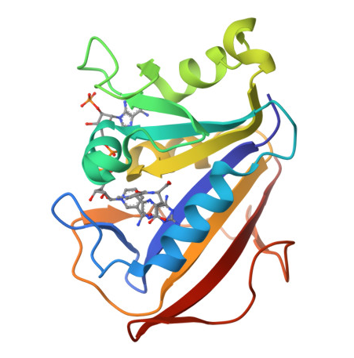

# Insilico-Lab-CADD-Training
Repository documenting my work in The Insilico Lab' 3-Week(-).

# Insilico Lab - CADD Training (Cohort 5)
Repository documenting my work in The Insilico Lab's 3-Week Virtual Training in Computer-Aided Drug Design (CADD), Cohort 5 (July 2026). Covers protein/ligand preparation, molecular docking, ADMET screening, and AI-based structure prediction, using PyMOL, UCSF Chimera, RCSB PDB, and proteins.plus.

## 📅 Training Overview
- **Program:** The Insilico Lab, 3-Week Virtual Training in CADD
- **Cohort:** 5
- **Dates:** July 3 – July 19, 2026
- **Tools used:** PyMOL, UCSF Chimera, RCSB PDB, proteins.plus (DoGSiteScorer), AlphaFold3

## 📂 Repository Structure
```
Insilico-Lab-CADD-Training/
|
├── Week1_Protein_Target_Selection/
│   ├── Task1_Structure_Selection/
│   ├── Task2_Binding_Site_Analysis/
│   ├── Task3_Protein_Preparation/
│   └── screenshots/
├── Week2_.../
├── Week3_.../
└── README.md   
```

## 🧬 Week 1 - Protein Target Selection, Binding Site Analysis & Preparation

**Target:** Human Dihydrofolate Reductase (DHFR) - PDB ID [1U72](https://www.rcsb.org/structure/1U72)
<p align="center">
  
</p>

### Task 1 - Structure Selection
- Resolution: 1.90 Å (X-ray diffraction)
- Ligand: Methotrexate (MTX), cofactor NADPH
- [Screenshot 1 - full protein view]
- [Screenshot 2 - ligand in binding pocket]

### Task 2 - Binding Site Analysis
- Tool: DoGSiteScorer
- Top pocket: P_0 (Drug Score 0.81)
- Key residues: Ile7, Glu30, Phe31, Phe34, Val115, Tyr121, Arg70
- [Screenshot 3 - labeled binding pocket]

### Task 3 - Protein Preparation
- Cleaned in UCSF Chimera (waters removed, hydrogens/charges added via Dock Prep)
- Output: `1U72prepared.pdb`
- [Screenshot 4 - before] / [Screenshot 5 - after]

## 🔗 LinkedIn Post
[[Post LinkedIn]](https://www.linkedin.com/posts/carenmoreno-biotech_cadd-drugdiscovery-computationalbiology-activity-7480986480912543744-KnuO?utm_source=share&utm_medium=member_desktop&rcm=ACoAAEsbrkQBSPdKimnT3ne9nmTt0Sueta1viM4)
